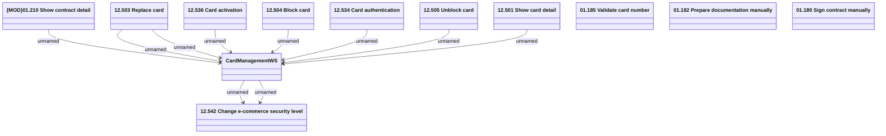

# Card Management - Related functionalities

```mermaid
classDiagram
    class n_12_542_Change_e_commerce_security_level["12.542 Change e-commerce security level"]
    class n_12_505_Unblock_card["12.505 Unblock card"]
    class n_12_504_Block_card["12.504 Block card"]
    class n_12_534_Card_authentication["12.534 Card authentication"]
    class n_12_503_Replace_card["12.503 Replace card"]
    class n_12_536_Card_activation["12.536 Card activation"]
    class MOD_01_210_Show_contract_detail["{MOD}01.210 Show contract detail"]
    class n_12_501_Show_card_detail["12.501 Show card detail"]
    class n_01_185_Validate_card_number["01.185 Validate card number"]
    class n_01_182_Prepare_documentation_manually["01.182 Prepare documentation manually"]
    class n_01_180_Sign_contract_manually["01.180 Sign contract manually"]
    class CardManagementWS["CardManagementWS"]
    CardManagementWS --> n_12_542_Change_e_commerce_security_level : unnamed
    CardManagementWS --> n_12_542_Change_e_commerce_security_level : unnamed
    MOD_01_210_Show_contract_detail --> CardManagementWS : unnamed
    n_12_503_Replace_card --> CardManagementWS : unnamed
    n_12_503_Replace_card --> CardManagementWS : unnamed
    n_12_536_Card_activation --> CardManagementWS : unnamed
    n_12_504_Block_card --> CardManagementWS : unnamed
    n_12_534_Card_authentication --> CardManagementWS : unnamed
    n_12_505_Unblock_card --> CardManagementWS : unnamed
    n_12_501_Show_card_detail --> CardManagementWS : unnamed
```
