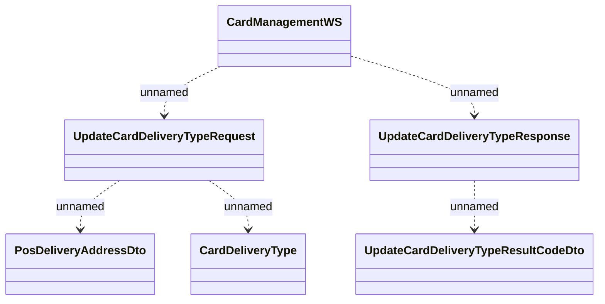

# Card Management - Update card delivery address

- **Diagram Type**: Logical
- **Package**: HomerSelect/BSL/Analysis Model/_Interface/Consumed services/Payment Card system/Card/Card Management
- **Diagram ID**: 111682
- **Elements**: 6
- **Connectors**: 5

