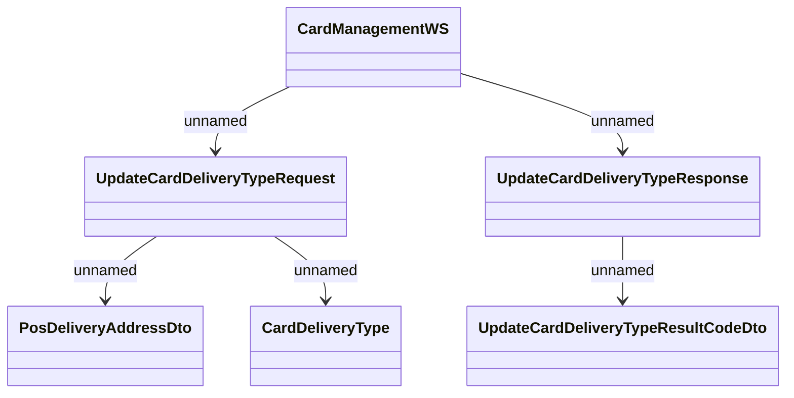

# Card Management - Update card delivery address

```mermaid
classDiagram
    class CardDeliveryType["CardDeliveryType"]
    class PosDeliveryAddressDto["PosDeliveryAddressDto"]
    class UpdateCardDeliveryTypeResultCodeDto["UpdateCardDeliveryTypeResultCodeDto"]
    class UpdateCardDeliveryTypeResponse["UpdateCardDeliveryTypeResponse"]
    class UpdateCardDeliveryTypeRequest["UpdateCardDeliveryTypeRequest"]
    class CardManagementWS["CardManagementWS"]
    CardManagementWS --> UpdateCardDeliveryTypeRequest : unnamed
    CardManagementWS --> UpdateCardDeliveryTypeResponse : unnamed
    UpdateCardDeliveryTypeResponse --> UpdateCardDeliveryTypeResultCodeDto : unnamed
    UpdateCardDeliveryTypeRequest --> PosDeliveryAddressDto : unnamed
    UpdateCardDeliveryTypeRequest --> CardDeliveryType : unnamed
```
