# Card management - Interface diagram

- **Diagram Type**: Logical
- **Package**: HomerSelect/BSL/Analysis Model/_Interface/Consumed services/Payment Card system/Card/Card Management
- **Diagram ID**: 111680
- **Elements**: 47
- **Connectors**: 45

```mermaid
classDiagram
    class UpdateEmbossNameResponse["UpdateEmbossNameResponse"]
    class UpdateEmbossNameRequest["UpdateEmbossNameRequest"]
    class VerifyEmbossNameResponse["VerifyEmbossNameResponse"]
    class CreateEmbossNameResponse["CreateEmbossNameResponse"]
    class VerifyEmbossNameRequest["VerifyEmbossNameRequest"]
    class CreateEmbossNameRequest["CreateEmbossNameRequest"]
    class FindCardResultCodeDto["FindCardResultCodeDto"]
    class GetAllowedCardOperationsForUserResponse["GetAllowedCardOperationsForUserResponse"]
    class GetAllowedCardOperationsForUserRequest["GetAllowedCardOperationsForUserRequest"]
    class GetPlasticsOfCardResponse["GetPlasticsOfCardResponse"]
    class GetPlasticsOfCardRequest["GetPlasticsOfCardRequest"]
    class FindCardResponse["FindCardResponse"]
    class FindCardRequest["FindCardRequest"]
    class CardManagement_Card_management_Messages_Interface_diagram["CardManagement : Card management - Messages - Interface diagram"]
    class ConfirmPersonalizedCardResponse["ConfirmPersonalizedCardResponse"]
    class ConfirmPersonalizedCardRequest["ConfirmPersonalizedCardRequest"]
    class CreatePersonalizedCardResponse["CreatePersonalizedCardResponse"]
    class CreatePersonalizedCardRequest["CreatePersonalizedCardRequest"]
    class GetCardsResponse["GetCardsResponse"]
    class GetCardsRequest["GetCardsRequest"]
    class GetCardResponse["GetCardResponse"]
    class GetCardRequest["GetCardRequest"]
    class ReplaceCardResponse["ReplaceCardResponse"]
    class ReplaceCardRequest["ReplaceCardRequest"]
    class SetCardLimitsResponse["SetCardLimitsResponse"]
    class SetCardLimitsRequest["SetCardLimitsRequest"]
    class HoldBackCardResponse["HoldBackCardResponse"]
    class HoldBackCardRequest["HoldBackCardRequest"]
    class AddOperatorNoteResponse["AddOperatorNoteResponse"]
    class AddOperatorNoteRequest["AddOperatorNoteRequest"]
    class ActivateCardResponse["ActivateCardResponse"]
    class ActivateCardRequest["ActivateCardRequest"]
    class BlockCardResponse["BlockCardResponse"]
    class BlockCardRequest["BlockCardRequest"]
    class UnblockCardResponse["UnblockCardResponse"]
    class UnblockCardRequest["UnblockCardRequest"]
    class ReserveCardResponse["ReserveCardResponse"]
    class ReserveCardRequest["ReserveCardRequest"]
    class StolenCardResponse["StolenCardResponse"]
    class StolenCardRequest["StolenCardRequest"]
    class CancelCardResponse["CancelCardResponse"]
    class CancelCardRequest["CancelCardRequest"]
    class LostCardResponse["LostCardResponse"]
    class LostCardRequest["LostCardRequest"]
    class ConfirmInstantCardResponse["ConfirmInstantCardResponse"]
    class ConfirmInstantCardRequest["ConfirmInstantCardRequest"]
    class CardManagementWS["CardManagementWS"]
    CardManagementWS ..> GetPlasticsOfCardRequest : unnamed
    CardManagementWS ..> GetCardRequest : unnamed
    CardManagementWS ..> GetCardResponse : unnamed
    CardManagementWS --> GetCardsRequest : unnamed
    CardManagementWS --> GetCardsResponse : unnamed
    CardManagementWS ..> CreatePersonalizedCardRequest : unnamed
    CardManagementWS ..> CreatePersonalizedCardResponse : unnamed
    CardManagementWS ..> ConfirmPersonalizedCardRequest : unnamed
    CardManagementWS ..> ConfirmPersonalizedCardResponse : unnamed
    CardManagementWS ..> UpdateEmbossNameResponse : unnamed
    CardManagementWS --> FindCardResponse : unnamed
    CardManagementWS ..> SetCardLimitsResponse : unnamed
    CardManagementWS ..> GetPlasticsOfCardResponse : unnamed
    CardManagementWS --> GetAllowedCardOperationsForUserRequest : unnamed
    CardManagementWS --> GetAllowedCardOperationsForUserResponse : unnamed
    FindCardResponse ..> FindCardResultCodeDto : unnamed
    CardManagementWS ..> CreateEmbossNameRequest : unnamed
    CardManagementWS ..> VerifyEmbossNameRequest : unnamed
    CardManagementWS ..> CreateEmbossNameResponse : unnamed
    CardManagementWS ..> VerifyEmbossNameResponse : unnamed
    CardManagementWS ..> UpdateEmbossNameRequest : unnamed
    CardManagementWS --> FindCardRequest : unnamed
    CardManagementWS ..> BlockCardRequest : unnamed
    CardManagementWS ..> ConfirmInstantCardResponse : unnamed
    CardManagementWS ..> LostCardRequest : unnamed
    CardManagementWS ..> LostCardResponse : unnamed
    CardManagementWS ..> CancelCardRequest : unnamed
    CardManagementWS ..> CancelCardResponse : unnamed
    CardManagementWS ..> StolenCardRequest : unnamed
    CardManagementWS ..> StolenCardResponse : unnamed
    CardManagementWS ..> ReserveCardRequest : unnamed
    CardManagementWS ..> ReserveCardResponse : unnamed
    CardManagementWS ..> ReplaceCardResponse : unnamed
    CardManagementWS ..> UnblockCardResponse : unnamed
    CardManagementWS ..> ReplaceCardRequest : unnamed
    CardManagementWS ..> BlockCardResponse : unnamed
    CardManagementWS ..> ActivateCardRequest : unnamed
    CardManagementWS ..> ActivateCardResponse : unnamed
    CardManagementWS ..> AddOperatorNoteRequest : unnamed
    CardManagementWS ..> AddOperatorNoteResponse : unnamed
    CardManagementWS ..> HoldBackCardRequest : unnamed
    CardManagementWS ..> HoldBackCardResponse : unnamed
    CardManagementWS ..> SetCardLimitsRequest : unnamed
    CardManagementWS ..> ConfirmInstantCardRequest : unnamed
    CardManagementWS ..> UnblockCardRequest : unnamed
```

