# Card management - Messages - Interface diagram

- **Diagram Type**: Logical
- **Package**: HomerSelect/BSL/Analysis Model/_Interface/Consumed services/Payment Card system/Card/Card Management/Card Management - Messages
- **Diagram ID**: 93373
- **Elements**: 71
- **Connectors**: 20

```mermaid
classDiagram
    class UpdateCardDeliveryTypeResultCodeDto["UpdateCardDeliveryTypeResultCodeDto"]
    class CardDeliveryType["CardDeliveryType"]
    class UpdateCardDeliveryTypeResponse["UpdateCardDeliveryTypeResponse"]
    class UpdateCardDeliveryTypeRequest["UpdateCardDeliveryTypeRequest"]
    class VerifyEmbossNameResultCodeDto["VerifyEmbossNameResultCodeDto"]
    class CreateEmbossNameResultCodeDto["CreateEmbossNameResultCodeDto"]
    class UpdateEmbossNameResponse["UpdateEmbossNameResponse"]
    class UpdateEmbossNameRequest["UpdateEmbossNameRequest"]
    class VerifyEmbossNameResponse["VerifyEmbossNameResponse"]
    class CreateEmbossNameResponse["CreateEmbossNameResponse"]
    class VerifyEmbossNameRequest["VerifyEmbossNameRequest"]
    class CreateEmbossNameRequest["CreateEmbossNameRequest"]
    class NotifyPinChangeResponse["NotifyPinChangeResponse"]
    class NotifyPinChangeRequest["NotifyPinChangeRequest"]
    class CardBlockHardCheckDto["CardBlockHardCheckDto"]
    class ReplaceCardResultCodeDto["ReplaceCardResultCodeDto"]
    class GetCardsResponseResultCodeDto["GetCardsResponseResultCodeDto"]
    class UnblockCardsByAccountNumberResponse["UnblockCardsByAccountNumberResponse"]
    class UnblockCardsByAccountNumberRequest["UnblockCardsByAccountNumberRequest"]
    class BlockCardsByAccountNumberResponse["BlockCardsByAccountNumberResponse"]
    class BlockCardsByAccountNumberRequest["BlockCardsByAccountNumberRequest"]
    class UserPrivilegeToBlockUnblockCardWithReasonDto["UserPrivilegeToBlockUnblockCardWithReasonDto"]
    class GetAllowedCardOperationsForUserResponse["GetAllowedCardOperationsForUserResponse"]
    class GetAllowedCardOperationsForUserRequest["GetAllowedCardOperationsForUserRequest"]
    class NewCardBlockDto["NewCardBlockDto"]
    class GetPlasticsOfCardResultCodeDto["GetPlasticsOfCardResultCodeDto"]
    class GetPlasticsOfCardResponse["GetPlasticsOfCardResponse"]
    class GetPlasticsOfCardRequest["GetPlasticsOfCardRequest"]
    class FindCardResponse["FindCardResponse"]
    class FindCardRequest["FindCardRequest"]
    class ActivateCardResultCodeDto["ActivateCardResultCodeDto"]
    class Card_structures_Card_management_Card_structures_Interface_di["Card structures : Card management - Card structures - Interface diagram"]
    class HardCheckResultDto["HardCheckResultDto"]
    class HardCheckTypeDto["HardCheckTypeDto"]
    class HardCheckDto["HardCheckDto"]
    class ConfirmInstantCardResultCodeDto["ConfirmInstantCardResultCodeDto"]
    class ConfirmPersonalizedCardResultCodeDto["ConfirmPersonalizedCardResultCodeDto"]
    class ConfirmPersonalizedCardResponse["ConfirmPersonalizedCardResponse"]
    class ConfirmPersonalizedCardRequest["ConfirmPersonalizedCardRequest"]
    class CreatePersonalizedCardResultCodeDto["CreatePersonalizedCardResultCodeDto"]
    class CreatePersonalizedCardResponse["CreatePersonalizedCardResponse"]
    class CreatePersonalizedCardRequest["CreatePersonalizedCardRequest"]
    class ReserveCardResultCodeDto["ReserveCardResultCodeDto"]
    class ReplaceCardResponse["ReplaceCardResponse"]
    class ReplaceCardRequest["ReplaceCardRequest"]
    class GetCardsResponse["GetCardsResponse"]
    class GetCardsRequest["GetCardsRequest"]
    class GetCardResponse["GetCardResponse"]
    class GetCardRequest["GetCardRequest"]
    class SetCardLimitsResponse["SetCardLimitsResponse"]
    class SetCardLimitsRequest["SetCardLimitsRequest"]
    class HoldBackCardResponse["HoldBackCardResponse"]
    class HoldBackCardRequest["HoldBackCardRequest"]
    class AddOperatorNoteResponse["AddOperatorNoteResponse"]
    class AddOperatorNoteRequest["AddOperatorNoteRequest"]
    class CancelCardResponse["CancelCardResponse"]
    class CancelCardRequest["CancelCardRequest"]
    class StolenCardResponse["StolenCardResponse"]
    class StolenCardRequest["StolenCardRequest"]
    class LostCardResponse["LostCardResponse"]
    class LostCardRequest["LostCardRequest"]
    class UnblockCardResponse["UnblockCardResponse"]
    class UnblockCardRequest["UnblockCardRequest"]
    class BlockCardResponse["BlockCardResponse"]
    class BlockCardRequest["BlockCardRequest"]
    class ActivateCardResponse["ActivateCardResponse"]
    class ActivateCardRequest["ActivateCardRequest"]
    class ReserveCardResponse["ReserveCardResponse"]
    class ReserveCardRequest["ReserveCardRequest"]
    class ConfirmInstantCardResponse["ConfirmInstantCardResponse"]
    class ConfirmInstantCardRequest["ConfirmInstantCardRequest"]
    CreatePersonalizedCardRequest ..> CardDeliveryType : unnamed
    UpdateCardDeliveryTypeRequest ..> CardDeliveryType : unnamed
    GetAllowedCardOperationsForUserResponse --> UserPrivilegeToBlockUnblockCardWithReasonDto : unnamed
    GetAllowedCardOperationsForUserResponse --> UserPrivilegeToBlockUnblockCardWithReasonDto : unnamed
    GetPlasticsOfCardResponse ..> GetPlasticsOfCardResultCodeDto : unnamed
    UpdateCardDeliveryTypeResponse ..> UpdateCardDeliveryTypeResultCodeDto : unnamed
    CreatePersonalizedCardResponse ..> CreatePersonalizedCardResultCodeDto : unnamed
    ConfirmInstantCardRequest ..> CardDeliveryType : unnamed
    ReplaceCardResponse --> HardCheckDto : unnamed
    ReplaceCardResponse ..> ReplaceCardResultCodeDto : unnamed
    GetCardsResponse ..> GetCardsResponseResultCodeDto : unnamed
    BlockCardRequest --> NewCardBlockDto : unnamed
    ActivateCardResponse --> ActivateCardResultCodeDto : unnamed
    ActivateCardResponse --> HardCheckDto : unnamed
    ReserveCardResponse ..> ReserveCardResultCodeDto : unnamed
    ConfirmInstantCardResponse ..> ConfirmInstantCardResultCodeDto : unnamed
    ConfirmPersonalizedCardResponse ..> ConfirmPersonalizedCardResultCodeDto : unnamed
    HardCheckDto --> HardCheckResultDto : unnamed
    HardCheckDto --> HardCheckTypeDto : unnamed
    HardCheckDto <|-- CardBlockHardCheckDto : unnamed
```

