# Card management - Card structures - Interface diagram

- **Diagram Type**: Logical
- **Package**: HomerSelect/BSL/Analysis Model/_Interface/Consumed services/Payment Card system/Card/Card Management/Card Management - Types
- **Diagram ID**: 123821
- **Elements**: 45
- **Connectors**: 25

```mermaid
classDiagram
    class CardDeliveryType["CardDeliveryType"]
    class CardHolderName["CardHolderName"]
    class FindCardResultCodeDto["FindCardResultCodeDto"]
    class Card_Blockage_Reason["Card Blockage Reason"]
    class PosDeliveryAddressDto["PosDeliveryAddressDto"]
    class PeriodDto["PeriodDto"]
    class CardDetailDto["CardDetailDto"]
    class CardDto["CardDto"]
    class ModelGroup2["ModelGroup2"]
    class LimitDto["LimitDto"]
    class CardOperationDto["CardOperationDto"]
    class Card_AccountDto["Card: AccountDto"]
    class FullPan["FullPan"]
    class Digits["Digits"]
    class FlatNumber["FlatNumber"]
    class BlockNumber["BlockNumber"]
    class HouseNumber["HouseNumber"]
    class Street["Street"]
    class Town["Town"]
    class District["District"]
    class Region["Region"]
    class Zip["Zip"]
    class SellerPlaceCode["SellerPlaceCode"]
    class ApprovedCreditLimit["ApprovedCreditLimit"]
    class PositiveAmount["PositiveAmount"]
    class ServiceCode["ServiceCode"]
    class Digits4["Digits4"]
    class ContractCode["ContractCode"]
    class Note["Note"]
    class ReservationCode["ReservationCode"]
    class AccountNumber["AccountNumber"]
    class CardType["CardType"]
    class Currency["Currency"]
    class HolderName["HolderName"]
    class Cuid["Cuid"]
    class AccountIban["AccountIban"]
    class TruncatedPan["TruncatedPan"]
    class PaymentCardId["PaymentCardId"]
    class CardTypeDto["CardTypeDto"]
    class PlasticStatusDto["PlasticStatusDto"]
    class NewCardBlockDto["NewCardBlockDto"]
    class CardBlockDto["CardBlockDto"]
    class PlasticDto["PlasticDto"]
    class CardStatusDto["CardStatusDto"]
    class LDM["LDM"]
    PosDeliveryAddressDto ..> Street : unnamed
    NewCardBlockDto ..> Card_Blockage_Reason : unnamed
    CardDetailDto ..> PosDeliveryAddressDto : unnamed
    LimitDto ..> PeriodDto : unnamed
    CardDto <|-- CardDetailDto : unnamed
    LimitDto --> ModelGroup2 : unnamed
    CardDetailDto ..> LimitDto : unnamed
    CardDetailDto ..> CardOperationDto : unnamed
    CardDto ..> Card_AccountDto : unnamed
    Digits <|-- FullPan : unnamed
    PosDeliveryAddressDto ..> FlatNumber : unnamed
    CardDetailDto ..> CardDeliveryType : unnamed
    PosDeliveryAddressDto ..> HouseNumber : unnamed
    CardDto ..> CardStatusDto : unnamed
    PosDeliveryAddressDto ..> Town : unnamed
    PosDeliveryAddressDto ..> District : unnamed
    PosDeliveryAddressDto ..> Region : unnamed
    PosDeliveryAddressDto ..> Zip : unnamed
    PosDeliveryAddressDto ..> SellerPlaceCode : unnamed
    CardDto ..> CardTypeDto : unnamed
    PlasticDto ..> PlasticStatusDto : unnamed
    NewCardBlockDto <|-- CardBlockDto : unnamed
    CardDetailDto ..> CardBlockDto : unnamed
    CardDetailDto ..> PlasticDto : unnamed
    PosDeliveryAddressDto ..> BlockNumber : unnamed
```

