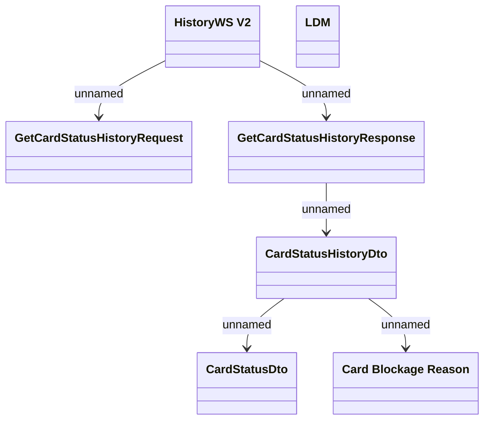

# History management - Interface diagram

```mermaid
classDiagram
    class Card_Blockage_Reason["Card Blockage Reason"]
    class CardStatusHistoryDto["CardStatusHistoryDto"]
    class CardStatusDto["CardStatusDto"]
    class GetCardStatusHistoryRequest["GetCardStatusHistoryRequest"]
    class GetCardStatusHistoryResponse["GetCardStatusHistoryResponse"]
    class HistoryWS_V2["HistoryWS V2"]
    class LDM["LDM"]
    HistoryWS_V2 --> GetCardStatusHistoryResponse : unnamed
    HistoryWS_V2 --> GetCardStatusHistoryRequest : unnamed
    CardStatusHistoryDto --> CardStatusDto : unnamed
    GetCardStatusHistoryResponse --> CardStatusHistoryDto : unnamed
    CardStatusHistoryDto --> Card_Blockage_Reason : unnamed
```
