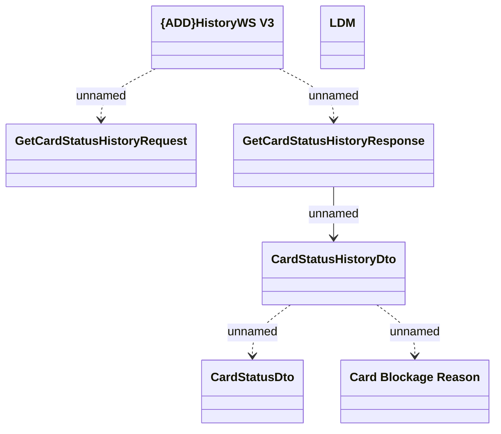

# History management - Interface diagram

- **Diagram Type**: Logical
- **Package**: HomerSelect/BSL/Analysis Model/_Interface/Consumed services/Payment Card system/History/HistoryWS V3
- **Diagram ID**: 127655
- **Elements**: 7
- **Connectors**: 5

