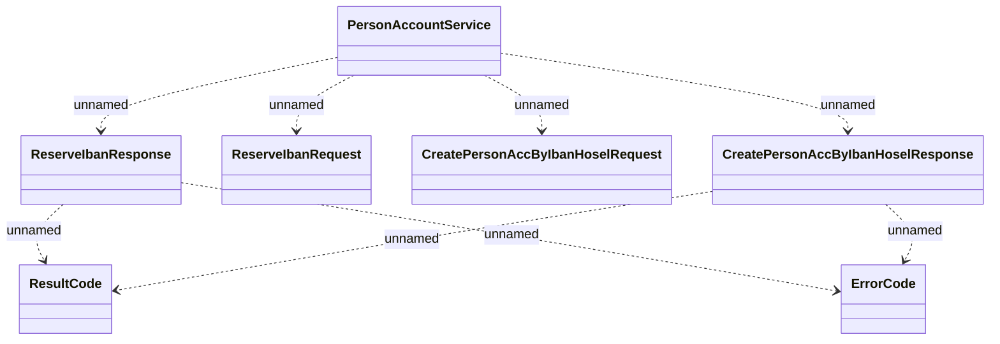

# PersonAccountService

- **Diagram Type**: Logical
- **Package**: HomerSelect/BSL/Analysis Model/_Interface/Consumed services/PersonAccountService
- **Diagram ID**: 123043
- **Elements**: 7
- **Connectors**: 8

