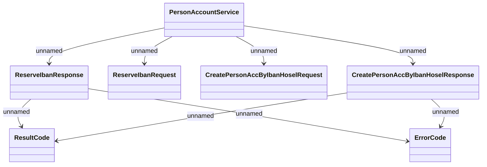

# PersonAccountService

```mermaid
classDiagram
    class ReserveIbanResponse["ReserveIbanResponse"]
    class ReserveIbanRequest["ReserveIbanRequest"]
    class CreatePersonAccByIbanHoselRequest["CreatePersonAccByIbanHoselRequest"]
    class ErrorCode["ErrorCode"]
    class ResultCode["ResultCode"]
    class CreatePersonAccByIbanHoselResponse["CreatePersonAccByIbanHoselResponse"]
    class PersonAccountService["PersonAccountService"]
    PersonAccountService --> CreatePersonAccByIbanHoselResponse : unnamed
    ReserveIbanResponse --> ResultCode : unnamed
    CreatePersonAccByIbanHoselResponse --> ResultCode : unnamed
    ReserveIbanResponse --> ErrorCode : unnamed
    CreatePersonAccByIbanHoselResponse --> ErrorCode : unnamed
    PersonAccountService --> CreatePersonAccByIbanHoselRequest : unnamed
    PersonAccountService --> ReserveIbanRequest : unnamed
    PersonAccountService --> ReserveIbanResponse : unnamed
```
