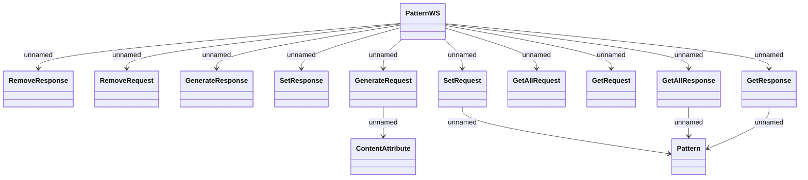

# PatternWS

```mermaid
classDiagram
    class ContentAttribute["ContentAttribute"]
    class Pattern["Pattern"]
    class RemoveResponse["RemoveResponse"]
    class RemoveRequest["RemoveRequest"]
    class GenerateResponse["GenerateResponse"]
    class SetResponse["SetResponse"]
    class GetResponse["GetResponse"]
    class GetAllResponse["GetAllResponse"]
    class GetAllRequest["GetAllRequest"]
    class GetRequest["GetRequest"]
    class SetRequest["SetRequest"]
    class GenerateRequest["GenerateRequest"]
    class PatternWS["PatternWS"]
    PatternWS --> GenerateRequest : unnamed
    PatternWS --> SetRequest : unnamed
    PatternWS --> GetRequest : unnamed
    PatternWS --> GetAllRequest : unnamed
    PatternWS --> GetAllResponse : unnamed
    PatternWS --> GetResponse : unnamed
    PatternWS --> SetResponse : unnamed
    PatternWS --> GenerateResponse : unnamed
    PatternWS --> RemoveRequest : unnamed
    PatternWS --> RemoveResponse : unnamed
    SetRequest --> Pattern : unnamed
    GetAllResponse --> Pattern : unnamed
    GetResponse --> Pattern : unnamed
    GenerateRequest --> ContentAttribute : unnamed
```
