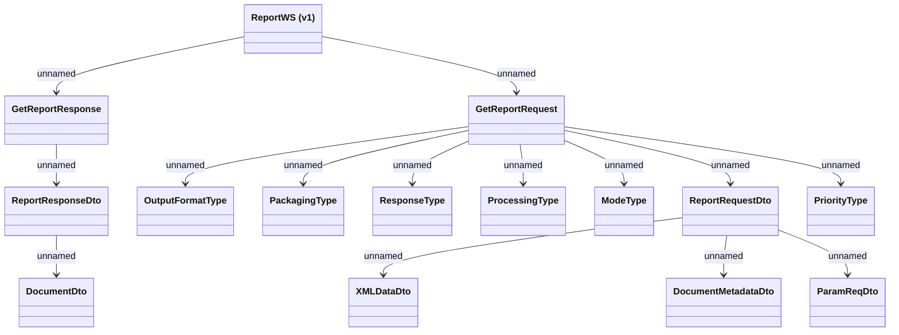

# ReportWS (v1)

```mermaid
classDiagram
    class PriorityType["PriorityType"]
    class ReportRequestDto["ReportRequestDto"]
    class ParamReqDto["ParamReqDto"]
    class DocumentDto["DocumentDto"]
    class DocumentMetadataDto["DocumentMetadataDto"]
    class ModeType["ModeType"]
    class ProcessingType["ProcessingType"]
    class ResponseType["ResponseType"]
    class PackagingType["PackagingType"]
    class OutputFormatType["OutputFormatType"]
    class XMLDataDto["XMLDataDto"]
    class ReportResponseDto["ReportResponseDto"]
    class GetReportRequest["GetReportRequest"]
    class ReportWS_v1["ReportWS (v1)"]
    class GetReportResponse["GetReportResponse"]
    ReportWS_v1 --> GetReportResponse : unnamed
    ReportWS_v1 --> GetReportRequest : unnamed
    GetReportResponse --> ReportResponseDto : unnamed
    ReportRequestDto --> XMLDataDto : unnamed
    GetReportRequest --> OutputFormatType : unnamed
    GetReportRequest --> PackagingType : unnamed
    GetReportRequest --> ResponseType : unnamed
    GetReportRequest --> ProcessingType : unnamed
    GetReportRequest --> ModeType : unnamed
    ReportRequestDto --> DocumentMetadataDto : unnamed
    ReportResponseDto --> DocumentDto : unnamed
    ReportRequestDto --> ParamReqDto : unnamed
    GetReportRequest --> ReportRequestDto : unnamed
    GetReportRequest --> PriorityType : unnamed
```
