# ReportWS (v3)

- **Diagram Type**: Logical
- **Package**: HomerSelect/BSL/Analysis Model/_Interface/Consumed services/Print Server/ReportWS/ReportWS (v3)
- **Diagram ID**: 130488
- **Elements**: 23
- **Connectors**: 27

```mermaid
classDiagram
    class SingleAndConcatenatedReportRequestType["SingleAndConcatenatedReportRequestType"]
    class ConcatenatedReportRequestType["ConcatenatedReportRequestType"]
    class DocumentMetadataType["DocumentMetadataType"]
    class CabinetReportRequestType["CabinetReportRequestType"]
    class SingleAndConcatenatedReportRequestListType["SingleAndConcatenatedReportRequestListType"]
    class ConcatenatedReportRequestListType["ConcatenatedReportRequestListType"]
    class SingleReportRequestType["SingleReportRequestType"]
    class SingleReportRequestListType["SingleReportRequestListType"]
    class SingleReportResponseType["SingleReportResponseType"]
    class CabinetReportResponseType["CabinetReportResponseType"]
    class SingleAndConcatenatedReportResponseType["SingleAndConcatenatedReportResponseType"]
    class ConcatenatedReportResponseType["ConcatenatedReportResponseType"]
    class SingleReportResponseListType["SingleReportResponseListType"]
    class ReportResponseType["ReportResponseType"]
    class ReportRequestType["ReportRequestType"]
    class ReportParameterType["ReportParameterType"]
    class OutputFormatType["OutputFormatType"]
    class PackagingType["PackagingType"]
    class ProcessingType["ProcessingType"]
    class ModeType["ModeType"]
    class ReportWS_v3["ReportWS (v3)"]
    class GenerateReportRequest["GenerateReportRequest"]
    class GenerateReportResponse["GenerateReportResponse"]
    ReportResponseType <|-- CabinetReportResponseType : unnamed
    ReportWS_v3 ..> GenerateReportResponse : unnamed
    GenerateReportRequest ..> ModeType : unnamed
    GenerateReportRequest ..> ProcessingType : unnamed
    GenerateReportRequest ..> PackagingType : unnamed
    GenerateReportRequest ..> OutputFormatType : unnamed
    SingleAndConcatenatedReportRequestType ..> ReportParameterType : unnamed
    SingleReportRequestType ..> ReportParameterType : unnamed
    ConcatenatedReportRequestType ..> ReportParameterType : unnamed
    ReportRequestType <|-- CabinetReportRequestType : unnamed
    ReportRequestType <|-- SingleReportRequestListType : unnamed
    ReportRequestType <|-- SingleAndConcatenatedReportRequestListType : unnamed
    ReportWS_v3 ..> GenerateReportRequest : unnamed
    ReportRequestType <|-- ConcatenatedReportRequestListType : unnamed
    SingleAndConcatenatedReportRequestListType ..> SingleAndConcatenatedReportRequestType : unnamed
    ReportResponseType <|-- SingleReportResponseListType : unnamed
    GenerateReportResponse ..> ReportResponseType : unnamed
    ReportResponseType <|-- ConcatenatedReportResponseType : unnamed
    ReportResponseType <|-- SingleAndConcatenatedReportResponseType : unnamed
    SingleReportRequestListType ..> SingleReportRequestType : unnamed
    SingleReportResponseListType ..> SingleReportResponseType : unnamed
    ConcatenatedReportResponseType ..> SingleReportResponseType : unnamed
    SingleAndConcatenatedReportResponseType ..> SingleReportResponseType : unnamed
    CabinetReportRequestType ..> DocumentMetadataType : unnamed
    ConcatenatedReportRequestListType ..> ConcatenatedReportRequestType : unnamed
    CabinetReportRequestType ..> ConcatenatedReportRequestType : unnamed
    GenerateReportRequest ..> ReportRequestType : unnamed
```

