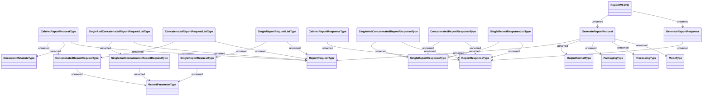

# ReportWS (v3)

```mermaid
classDiagram
    class SingleAndConcatenatedReportRequestType["SingleAndConcatenatedReportRequestType"]
    class ConcatenatedReportRequestType["ConcatenatedReportRequestType"]
    class DocumentMetadataType["DocumentMetadataType"]
    class CabinetReportRequestType["CabinetReportRequestType"]
    class SingleAndConcatenatedReportRequestListType["SingleAndConcatenatedReportRequestListType"]
    class ConcatenatedReportRequestListType["ConcatenatedReportRequestListType"]
    class SingleReportRequestType["SingleReportRequestType"]
    class SingleReportRequestListType["SingleReportRequestListType"]
    class SingleReportResponseType["SingleReportResponseType"]
    class CabinetReportResponseType["CabinetReportResponseType"]
    class SingleAndConcatenatedReportResponseType["SingleAndConcatenatedReportResponseType"]
    class ConcatenatedReportResponseType["ConcatenatedReportResponseType"]
    class SingleReportResponseListType["SingleReportResponseListType"]
    class ReportResponseType["ReportResponseType"]
    class ReportRequestType["ReportRequestType"]
    class ReportParameterType["ReportParameterType"]
    class OutputFormatType["OutputFormatType"]
    class PackagingType["PackagingType"]
    class ProcessingType["ProcessingType"]
    class ModeType["ModeType"]
    class ReportWS_v3["ReportWS (v3)"]
    class GenerateReportRequest["GenerateReportRequest"]
    class GenerateReportResponse["GenerateReportResponse"]
    CabinetReportResponseType --> ReportResponseType : unnamed
    ReportWS_v3 --> GenerateReportResponse : unnamed
    GenerateReportRequest --> ModeType : unnamed
    GenerateReportRequest --> ProcessingType : unnamed
    GenerateReportRequest --> PackagingType : unnamed
    GenerateReportRequest --> OutputFormatType : unnamed
    SingleAndConcatenatedReportRequestType --> ReportParameterType : unnamed
    SingleReportRequestType --> ReportParameterType : unnamed
    ConcatenatedReportRequestType --> ReportParameterType : unnamed
    CabinetReportRequestType --> ReportRequestType : unnamed
    SingleReportRequestListType --> ReportRequestType : unnamed
    SingleAndConcatenatedReportRequestListType --> ReportRequestType : unnamed
    ReportWS_v3 --> GenerateReportRequest : unnamed
    ConcatenatedReportRequestListType --> ReportRequestType : unnamed
    SingleAndConcatenatedReportRequestListType --> SingleAndConcatenatedReportRequestType : unnamed
    SingleReportResponseListType --> ReportResponseType : unnamed
    GenerateReportResponse --> ReportResponseType : unnamed
    ConcatenatedReportResponseType --> ReportResponseType : unnamed
    SingleAndConcatenatedReportResponseType --> ReportResponseType : unnamed
    SingleReportRequestListType --> SingleReportRequestType : unnamed
    SingleReportResponseListType --> SingleReportResponseType : unnamed
    ConcatenatedReportResponseType --> SingleReportResponseType : unnamed
    SingleAndConcatenatedReportResponseType --> SingleReportResponseType : unnamed
    CabinetReportRequestType --> DocumentMetadataType : unnamed
    ConcatenatedReportRequestListType --> ConcatenatedReportRequestType : unnamed
    CabinetReportRequestType --> ConcatenatedReportRequestType : unnamed
    GenerateReportRequest --> ReportRequestType : unnamed
```
