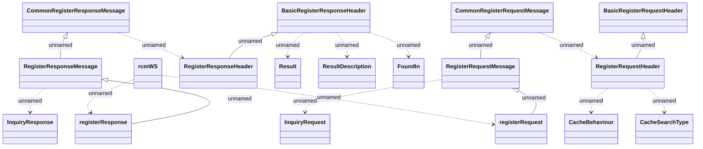

# rcmWS - Artajasa

- **Diagram Type**: Logical
- **Package**: HomerSelect/BSL/Analysis Model/_Interface/Consumed services/RCM/rcmWS
- **Diagram ID**: 150060
- **Elements**: 18
- **Connectors**: 17

