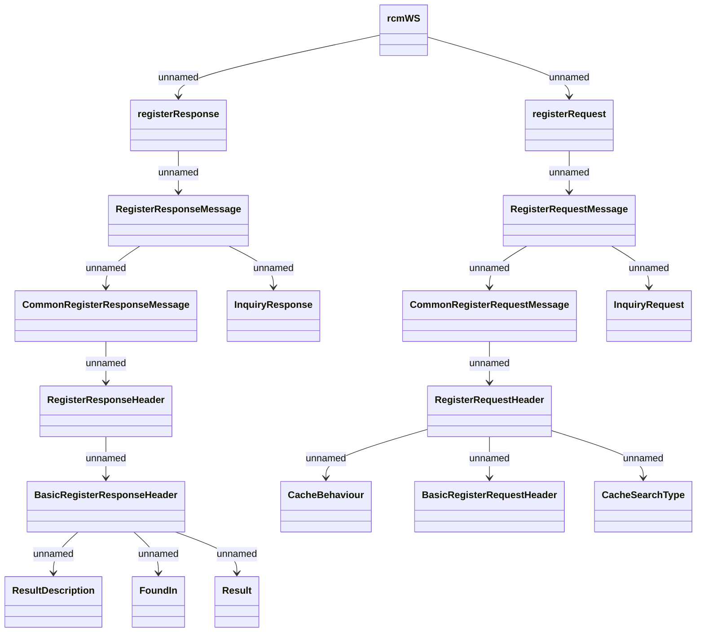

# rcmWS - Artajasa

```mermaid
classDiagram
    class InquiryRequest["InquiryRequest"]
    class registerResponse["registerResponse"]
    class registerRequest["registerRequest"]
    class InquiryResponse["InquiryResponse"]
    class RegisterResponseMessage["RegisterResponseMessage"]
    class RegisterRequestMessage["RegisterRequestMessage"]
    class BasicRegisterResponseHeader["BasicRegisterResponseHeader"]
    class CommonRegisterResponseMessage["CommonRegisterResponseMessage"]
    class RegisterResponseHeader["RegisterResponseHeader"]
    class Result["Result"]
    class ResultDescription["ResultDescription"]
    class FoundIn["FoundIn"]
    class CommonRegisterRequestMessage["CommonRegisterRequestMessage"]
    class RegisterRequestHeader["RegisterRequestHeader"]
    class BasicRegisterRequestHeader["BasicRegisterRequestHeader"]
    class CacheSearchType["CacheSearchType"]
    class CacheBehaviour["CacheBehaviour"]
    class rcmWS["rcmWS"]
    CommonRegisterResponseMessage --> RegisterResponseHeader : unnamed
    RegisterRequestHeader --> CacheBehaviour : unnamed
    BasicRegisterResponseHeader --> ResultDescription : unnamed
    BasicRegisterResponseHeader --> FoundIn : unnamed
    RegisterRequestMessage --> CommonRegisterRequestMessage : unnamed
    CommonRegisterRequestMessage --> RegisterRequestHeader : unnamed
    RegisterRequestHeader --> BasicRegisterRequestHeader : unnamed
    RegisterRequestHeader --> CacheSearchType : unnamed
    RegisterResponseMessage --> CommonRegisterResponseMessage : unnamed
    BasicRegisterResponseHeader --> Result : unnamed
    rcmWS --> registerResponse : unnamed
    rcmWS --> registerRequest : unnamed
    RegisterResponseMessage --> InquiryResponse : unnamed
    RegisterResponseHeader --> BasicRegisterResponseHeader : unnamed
    RegisterRequestMessage --> InquiryRequest : unnamed
    registerRequest --> RegisterRequestMessage : unnamed
    registerResponse --> RegisterResponseMessage : unnamed
```
