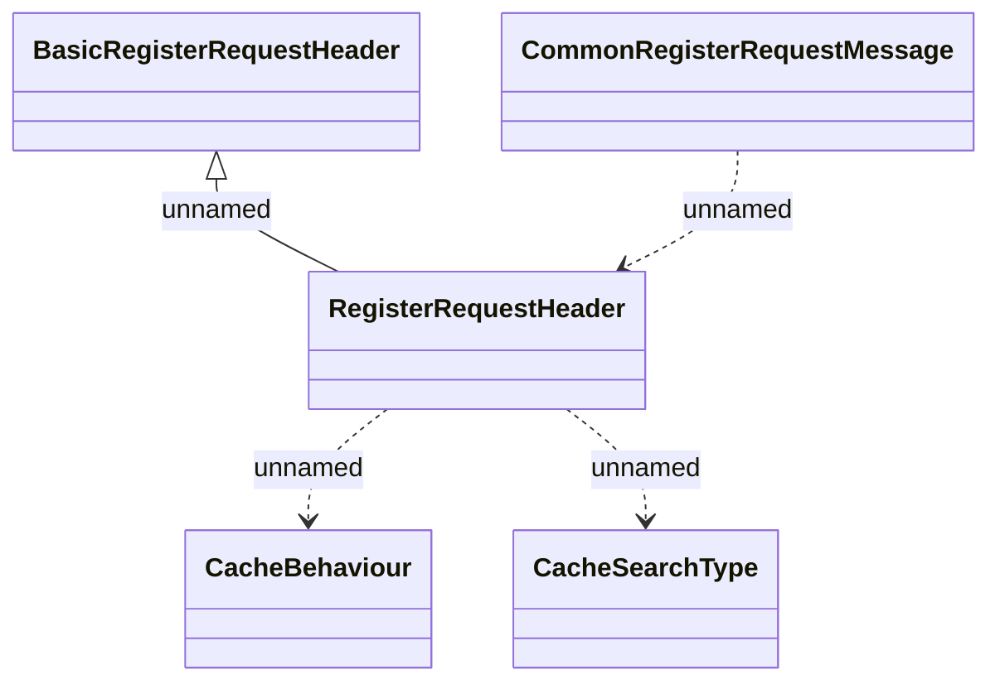

# CommonRegisterRequestMessage

- **Diagram Type**: Logical
- **Package**: HomerSelect/BSL/Analysis Model/_Interface/Consumed services/RCM/rcmWS/Types/Common (v2)
- **Diagram ID**: 113925
- **Elements**: 5
- **Connectors**: 4

