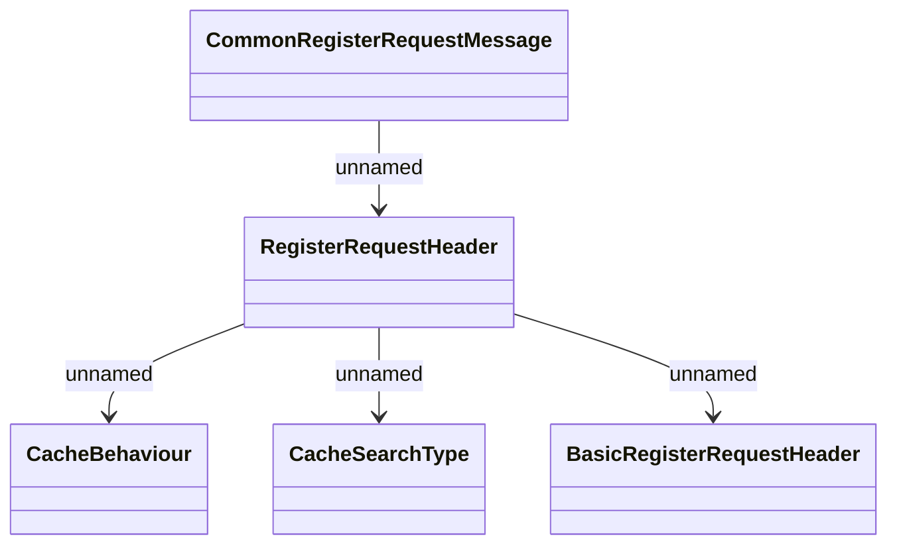

# CommonRegisterRequestMessage

```mermaid
classDiagram
    class CommonRegisterRequestMessage["CommonRegisterRequestMessage"]
    class RegisterRequestHeader["RegisterRequestHeader"]
    class BasicRegisterRequestHeader["BasicRegisterRequestHeader"]
    class CacheSearchType["CacheSearchType"]
    class CacheBehaviour["CacheBehaviour"]
    RegisterRequestHeader --> CacheBehaviour : unnamed
    RegisterRequestHeader --> CacheSearchType : unnamed
    RegisterRequestHeader --> BasicRegisterRequestHeader : unnamed
    CommonRegisterRequestMessage --> RegisterRequestHeader : unnamed
```
