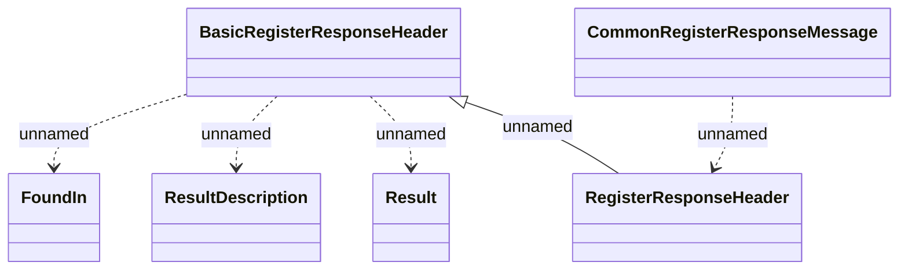

# CommonRegisterResponseMessage

- **Diagram Type**: Logical
- **Package**: HomerSelect/BSL/Analysis Model/_Interface/Consumed services/RCM/rcmWS/Types/Common (v2)
- **Diagram ID**: 113926
- **Elements**: 6
- **Connectors**: 5

