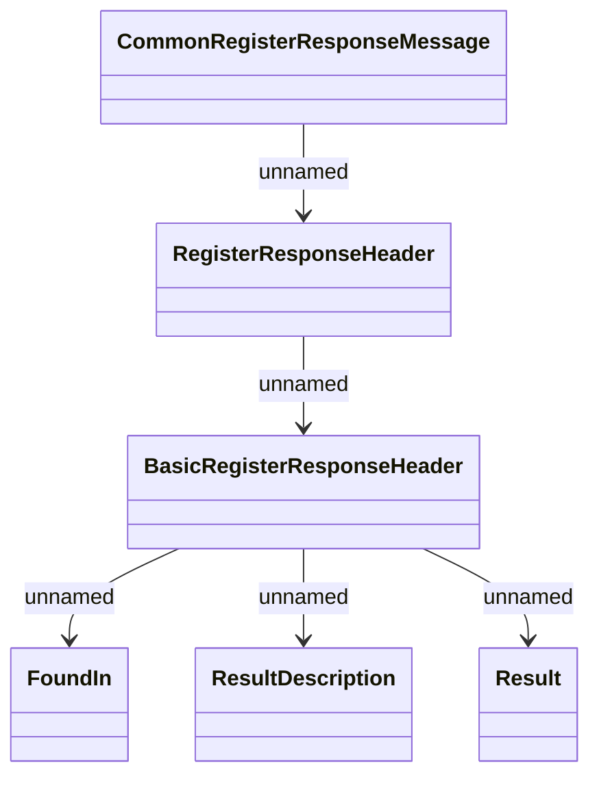

# CommonRegisterResponseMessage

```mermaid
classDiagram
    class BasicRegisterResponseHeader["BasicRegisterResponseHeader"]
    class CommonRegisterResponseMessage["CommonRegisterResponseMessage"]
    class RegisterResponseHeader["RegisterResponseHeader"]
    class Result["Result"]
    class ResultDescription["ResultDescription"]
    class FoundIn["FoundIn"]
    BasicRegisterResponseHeader --> FoundIn : unnamed
    BasicRegisterResponseHeader --> ResultDescription : unnamed
    BasicRegisterResponseHeader --> Result : unnamed
    CommonRegisterResponseMessage --> RegisterResponseHeader : unnamed
    RegisterResponseHeader --> BasicRegisterResponseHeader : unnamed
```
