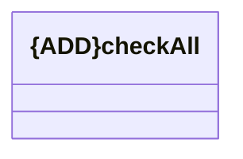

# checkAll

- **Diagram Type**: Logical
- **Package**: HomerSelect/BSL/Analysis Model/_Interface/Consumed services/REM/v1/checkAll
- **Diagram ID**: 151397
- **Elements**: 1
- **Connectors**: 0

```mermaid
classDiagram
    class ADD_checkAll["{ADD}checkAll"]
```
