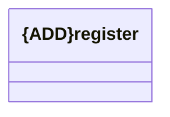

# register

- **Diagram Type**: Logical
- **Package**: HomerSelect/BSL/Analysis Model/_Interface/Consumed services/REM/v1/register
- **Diagram ID**: 149308
- **Elements**: 1
- **Connectors**: 0

```mermaid
classDiagram
    class ADD_register["{ADD}register"]
```
