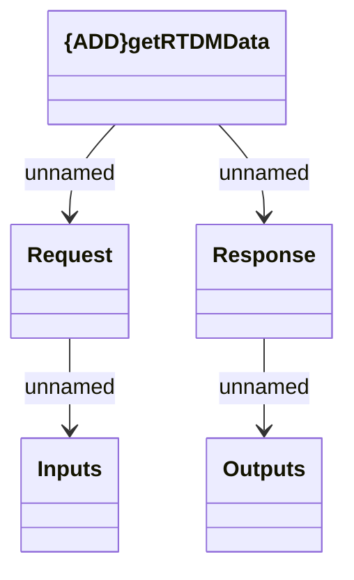

# getRDMData

```mermaid
classDiagram
    class Outputs["Outputs"]
    class Response["Response"]
    class Inputs["Inputs"]
    class Request["Request"]
    class ADD_getRTDMData["{ADD}getRTDMData"]
    ADD_getRTDMData --> Request : unnamed
    Request --> Inputs : unnamed
    ADD_getRTDMData --> Response : unnamed
    Response --> Outputs : unnamed
```
