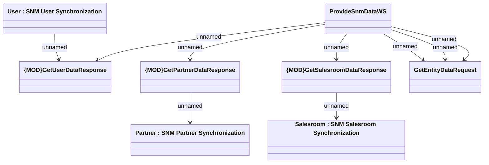

# Consumed Web service ProvideSNMDataWS

```mermaid
classDiagram
    class Partner_SNM_Partner_Synchronization["Partner : SNM Partner Synchronization"]
    class Salesroom_SNM_Salesroom_Synchronization["Salesroom : SNM Salesroom Synchronization"]
    class User_SNM_User_Synchronization["User : SNM User Synchronization"]
    class MOD_GetUserDataResponse["{MOD}GetUserDataResponse"]
    class MOD_GetSalesroomDataResponse["{MOD}GetSalesroomDataResponse"]
    class MOD_GetPartnerDataResponse["{MOD}GetPartnerDataResponse"]
    class GetEntityDataRequest["GetEntityDataRequest"]
    class ProvideSnmDataWS["ProvideSnmDataWS"]
    MOD_GetPartnerDataResponse --> Partner_SNM_Partner_Synchronization : unnamed
    ProvideSnmDataWS --> GetEntityDataRequest : unnamed
    ProvideSnmDataWS --> GetEntityDataRequest : unnamed
    ProvideSnmDataWS --> GetEntityDataRequest : unnamed
    ProvideSnmDataWS --> MOD_GetPartnerDataResponse : unnamed
    ProvideSnmDataWS --> MOD_GetSalesroomDataResponse : unnamed
    ProvideSnmDataWS --> MOD_GetUserDataResponse : unnamed
    User_SNM_User_Synchronization --> MOD_GetUserDataResponse : unnamed
    MOD_GetSalesroomDataResponse --> Salesroom_SNM_Salesroom_Synchronization : unnamed
```
