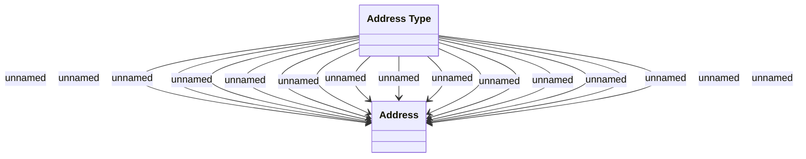

# SNM Address Synchronization

```mermaid
classDiagram
    class Address["Address"]
    class Address_Type["Address Type"]
    Address_Type --> Address : unnamed
    Address_Type --> Address : unnamed
    Address_Type --> Address : unnamed
    Address_Type --> Address : unnamed
    Address_Type --> Address : unnamed
    Address_Type --> Address : unnamed
    Address_Type --> Address : unnamed
    Address_Type --> Address : unnamed
    Address_Type --> Address : unnamed
    Address_Type --> Address : unnamed
    Address_Type --> Address : unnamed
    Address_Type --> Address : unnamed
    Address_Type --> Address : unnamed
    Address_Type --> Address : unnamed
    Address_Type --> Address : unnamed
```
