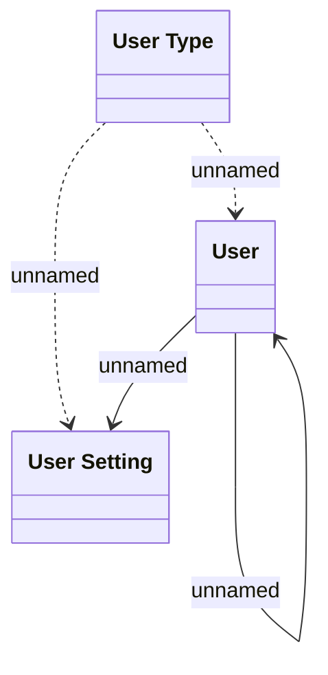

# SNM General User Synchronization

- **Diagram Type**: Logical
- **Package**: HomerSelect/BSL/Analysis Model/_Interface/Consumed services/SNM Synchronization/COMMON for SNM Synchronization
- **Diagram ID**: 104313
- **Elements**: 3
- **Connectors**: 4

