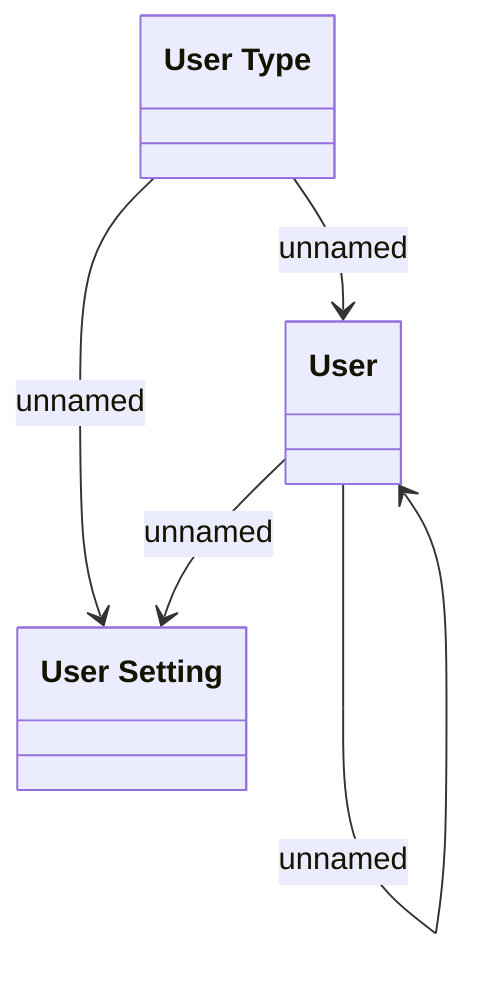

# SNM General User Synchronization

```mermaid
classDiagram
    class User_Setting["User Setting"]
    class User_Type["User Type"]
    class User["User"]
    User_Type --> User : unnamed
    User_Type --> User_Setting : unnamed
    User --> User_Setting : unnamed
    User --> User : unnamed
```
