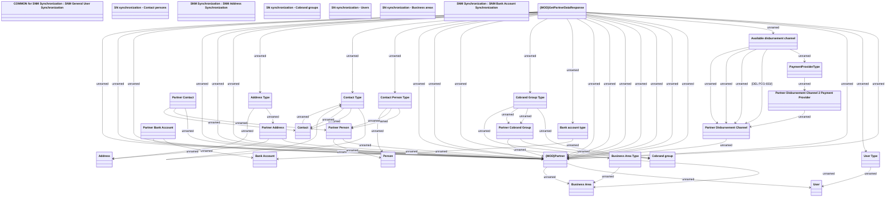

# SNM Partner Synchronization

```mermaid
classDiagram
    class Partner_Disbursement_Channel_2_Payment_Provider["Partner Disbursement Channel 2 Payment Provider"]
    class PaymentProviderType["PaymentProviderType"]
    class COMMON_for_SNM_Synchronization_SNM_General_User_Synchronizat["COMMON for SNM Synchronization : SNM General User Synchronization"]
    class SN_synchronization_Contact_persons["SN synchronization - Contact persons"]
    class Bank_Account["Bank Account"]
    class Bank_account_type["Bank account type"]
    class SNM_Synchronization_SNM_Address_Synchronization["SNM Synchronization : SNM Address Synchronization"]
    class SN_synchronization_Cobrand_groups["SN synchronization - Cobrand groups"]
    class SN_synchronization_Users["SN synchronization - Users"]
    class SN_synchronization_Business_areas["SN synchronization - Business areas"]
    class SNM_Synchronization_SNM_Bank_Account_Synchronization["SNM Synchronization : SNM Bank Account Synchronization"]
    class Cobrand_Group_Type["Cobrand Group Type"]
    class Cobrand_group["Cobrand group"]
    class Partner_Cobrand_Group["Partner Cobrand Group"]
    class Partner_Disbursement_Channel["Partner Disbursement Channel"]
    class Available_disbursement_channel["Available disbursement channel"]
    class Business_Area_Type["Business Area Type"]
    class Contact_Type["Contact Type"]
    class User_Type["User Type"]
    class Partner_Bank_Account["Partner Bank Account"]
    class Partner_Person["Partner Person"]
    class Partner_Contact["Partner Contact"]
    class Partner_Address["Partner Address"]
    class MOD_Partner["{MOD}Partner"]
    class Address["Address"]
    class Business_Area["Business Area"]
    class Person["Person"]
    class User["User"]
    class Contact["Contact"]
    class MOD_GetPartnerDataResponse["{MOD}GetPartnerDataResponse"]
    class Contact_Person_Type["Contact Person Type"]
    class Contact_Type["Contact Type"]
    class Address_Type["Address Type"]
    MOD_GetPartnerDataResponse --> MOD_Partner : unnamed
    Contact_Type --> Contact_Type : unnamed
    MOD_GetPartnerDataResponse --> User_Type : unnamed
    Contact_Person_Type --> Partner_Person : unnamed
    Contact_Person_Type --> Partner_Person : unnamed
    Address_Type --> Partner_Address : unnamed
    PaymentProviderType --> Partner_Disbursement_Channel_2_Payment_Provider : unnamed
    MOD_GetPartnerDataResponse --> MOD_Partner : unnamed
    MOD_GetPartnerDataResponse --> Available_disbursement_channel : unnamed
    MOD_GetPartnerDataResponse --> MOD_Partner : unnamed
    MOD_GetPartnerDataResponse --> MOD_Partner : unnamed
    MOD_GetPartnerDataResponse --> MOD_Partner : unnamed
    MOD_GetPartnerDataResponse --> MOD_Partner : unnamed
    MOD_GetPartnerDataResponse --> MOD_Partner : unnamed
    MOD_GetPartnerDataResponse --> MOD_Partner : unnamed
    MOD_GetPartnerDataResponse --> MOD_Partner : unnamed
    Cobrand_Group_Type --> Cobrand_group : unnamed
    Available_disbursement_channel --> PaymentProviderType : unnamed
    Bank_account_type --> Bank_Account : unnamed
    MOD_GetPartnerDataResponse --> Bank_account_type : unnamed
    MOD_GetPartnerDataResponse --> Cobrand_Group_Type : unnamed
    MOD_GetPartnerDataResponse --> Business_Area_Type : unnamed
    Cobrand_Group_Type --> Partner_Cobrand_Group : unnamed
    Cobrand_Group_Type --> Partner_Cobrand_Group : unnamed
    Available_disbursement_channel --> Partner_Disbursement_Channel : {DEL PCG-833/}
    Available_disbursement_channel --> Partner_Disbursement_Channel : unnamed
    Available_disbursement_channel --> Partner_Disbursement_Channel : unnamed
    Available_disbursement_channel --> Partner_Disbursement_Channel : unnamed
    MOD_GetPartnerDataResponse --> MOD_Partner : unnamed
    Cobrand_Group_Type --> Cobrand_group : unnamed
    MOD_GetPartnerDataResponse --> MOD_Partner : unnamed
    Business_Area_Type --> Business_Area : unnamed
    Business_Area_Type --> Business_Area : unnamed
    Contact_Person_Type --> Person : unnamed
    User_Type --> User : unnamed
    Contact_Type --> Contact : unnamed
    Contact_Type --> Contact : unnamed
    MOD_GetPartnerDataResponse --> Contact_Person_Type : unnamed
    MOD_GetPartnerDataResponse --> Contact_Type : unnamed
    Address_Type --> Address : unnamed
    MOD_GetPartnerDataResponse --> Address_Type : unnamed
    MOD_GetPartnerDataResponse --> MOD_Partner : unnamed
    MOD_GetPartnerDataResponse --> MOD_Partner : unnamed
    MOD_GetPartnerDataResponse --> MOD_Partner : unnamed
    MOD_GetPartnerDataResponse --> MOD_Partner : unnamed
    MOD_GetPartnerDataResponse --> MOD_Partner : unnamed
    MOD_GetPartnerDataResponse --> MOD_Partner : unnamed
    Partner_Bank_Account --> Bank_Account : unnamed
    Partner_Bank_Account --> MOD_Partner : unnamed
    Partner_Disbursement_Channel --> MOD_Partner : unnamed
    Partner_Disbursement_Channel_2_Payment_Provider --> Partner_Disbursement_Channel : unnamed
    Partner_Cobrand_Group --> Cobrand_group : unnamed
    Partner_Cobrand_Group --> MOD_Partner : unnamed
    Partner_Contact --> MOD_Partner : unnamed
    MOD_Partner --> User : unnamed
    Partner_Person --> MOD_Partner : unnamed
    MOD_Partner --> Business_Area : unnamed
    Partner_Address --> MOD_Partner : unnamed
    Partner_Person --> Person : unnamed
    Partner_Contact --> Partner_Person : unnamed
    Partner_Address --> Address : unnamed
    Partner_Contact --> Contact : unnamed
    Contact --> Contact_Type : unnamed
```
