# SNM Salesroom Synchronization

- **Diagram Type**: Logical
- **Package**: HomerSelect/BSL/Analysis Model/_Interface/Consumed services/SNM Synchronization/Salesroom
- **Diagram ID**: 142421
- **Elements**: 49
- **Connectors**: 111

```mermaid
classDiagram
    class Salesroom_2_Feature["Salesroom 2 Feature"]
    class ADD_Sales_District_Type["{ADD}Sales District Type"]
    class PaymentProviderType["PaymentProviderType"]
    class Salesroom_Disbursement_Channel_2_Payment_Provider["Salesroom Disbursement Channel 2 Payment Provider"]
    class Fingerprint_Reader_Type["Fingerprint Reader Type"]
    class SN_synchronization_Salesroom_document_types["SN synchronization - Salesroom document types"]
    class Document_Type_Type["Document Type Type"]
    class Salesroom_Document_Type["Salesroom Document Type"]
    class COMMON_for_SNM_Synchronization_SNM_General_User_Synchronizat["COMMON for SNM Synchronization : SNM General User Synchronization"]
    class SN_synchronization_Sales_area["SN synchronization - Sales area"]
    class SN_synchronization_Salesmans["SN synchronization - Salesmans"]
    class SN_synchronization_Cobrand_groups["SN synchronization - Cobrand groups"]
    class SN_synchronization_Contact_persons["SN synchronization - Contact persons"]
    class SN_synchronization_Business_areas["SN synchronization - Business areas"]
    class SNM_Synchronization_SNM_Bank_Account_Synchronization["SNM Synchronization : SNM Bank Account Synchronization"]
    class SNM_Synchronization_SNM_Address_Synchronization["SNM Synchronization : SNM Address Synchronization"]
    class Address["Address"]
    class Address_Type["Address Type"]
    class SN_synchronization_Users["SN synchronization - Users"]
    class Sales_Zone_Type["Sales Zone Type"]
    class Sales_Region_Type["Sales Region Type"]
    class Sales_Area["Sales Area"]
    class Cobrand_Group_Type["Cobrand Group Type"]
    class Cobrand_group["Cobrand group"]
    class Salesroom_Cobrand_Group["Salesroom Cobrand Group"]
    class Salesroom_Salesman["Salesroom Salesman"]
    class Salesroom_Disbursement_Channel["Salesroom Disbursement Channel"]
    class Available_disbursement_channel["Available disbursement channel"]
    class Salesman["Salesman"]
    class Salesman_Type["Salesman Type"]
    class Business_Area_Type["Business Area Type"]
    class Contact_Type["Contact Type"]
    class User_Type["User Type"]
    class Salesroom_Agent["Salesroom Agent"]
    class Salesroom_Commodity_Type["Salesroom Commodity Type"]
    class Bank_Account["Bank Account"]
    class Business_Area["Business Area"]
    class Person["Person"]
    class Salesroom_Contact["Salesroom Contact"]
    class Salesroom_Address["Salesroom Address"]
    class User["User"]
    class Contact["Contact"]
    class Salesroom_Person["Salesroom Person"]
    class Salesroom["Salesroom"]
    class Salesroom_Bank_Account["Salesroom Bank Account"]
    class Contact_Person_Type["Contact Person Type"]
    class Contact_Type["Contact Type"]
    class Bank_account_type["Bank account type"]
    class MOD_GetSalesroomDataResponse["{MOD}GetSalesroomDataResponse"]
    Salesman --> Person : unnamed
    Salesroom o-- Salesroom_Cobrand_Group : unnamed
    Salesman_Type ..> Person : unnamed
    Salesman_Type ..> Person : unnamed
    Salesman_Type ..> Person : unnamed
    Salesman_Type ..> Salesman : unnamed
    Business_Area_Type ..> Sales_Area : unnamed
    Salesman --> Salesroom_Salesman : unnamed
    Business_Area_Type ..> Business_Area : unnamed
    Available_disbursement_channel ..> Salesroom_Disbursement_Channel : unnamed
    Available_disbursement_channel ..> Salesroom_Disbursement_Channel : unnamed
    Available_disbursement_channel ..> Salesroom_Disbursement_Channel : unnamed
    Available_disbursement_channel ..> PaymentProviderType : unnamed
    Salesroom_Disbursement_Channel --> Salesroom : unnamed
    Salesroom o-- Salesroom_2_Feature : unnamed
    Salesman_Type ..> Salesman : unnamed
    Salesroom o-- Salesroom_Contact : unnamed
    Salesroom o-- Salesroom_Person : unnamed
    Contact --> Contact_Type : unnamed
    Salesroom o-- Salesroom_Address : unnamed
    Salesroom_Address --> Address : unnamed
    Business_Area_Type ..> Sales_Area : unnamed
    Salesroom_Contact --> Contact : unnamed
    Salesroom_Cobrand_Group ..> Cobrand_group : unnamed
    Salesroom_Person o-- Person : unnamed
    Salesroom o-- Salesroom_Commodity_Type : defines allowed
    Salesroom o-- Salesroom_Agent : unnamed
    Salesroom_Agent --> User : unnamed
    User_Type ..> User : unnamed
    Business_Area_Type ..> Business_Area : unnamed
    Salesroom_Contact --> Salesroom_Person : unnamed
    Salesroom o-- Salesroom_Salesman : unnamed
    Address_Type ..> Salesroom_Address : unnamed
    Salesroom o-- Salesroom_Document_Type : unnamed
    Document_Type_Type ..> Salesroom_Document_Type : unnamed
    Salesroom_Disbursement_Channel o-- Salesroom_Disbursement_Channel_2_Payment_Provider : unnamed
    PaymentProviderType ..> Salesroom_Disbursement_Channel_2_Payment_Provider : unnamed
    ADD_Sales_District_Type ..> Sales_Area : unnamed
    ADD_Sales_District_Type ..> Sales_Area : unnamed
    Sales_Zone_Type ..> Sales_Area : unnamed
    Cobrand_Group_Type ..> Cobrand_group : unnamed
    Cobrand_Group_Type ..> Salesroom_Cobrand_Group : unnamed
    Cobrand_Group_Type ..> Salesroom_Cobrand_Group : unnamed
    Cobrand_Group_Type ..> Cobrand_group : unnamed
    Sales_Region_Type ..> Sales_Area : unnamed
    Sales_Zone_Type ..> Sales_Area : unnamed
    Salesroom ..> Business_Area : unnamed
    Address_Type ..> Address : unnamed
    Sales_Region_Type ..> Sales_Area : unnamed
    MOD_GetSalesroomDataResponse ..> Salesroom : unnamed
    Salesroom ..> Sales_Area : unnamed
    MOD_GetSalesroomDataResponse ..> Salesroom : unnamed
    MOD_GetSalesroomDataResponse ..> Sales_Zone_Type : unnamed
    MOD_GetSalesroomDataResponse ..> Salesroom : unnamed
    MOD_GetSalesroomDataResponse ..> Salesroom : unnamed
    MOD_GetSalesroomDataResponse ..> Bank_account_type : unnamed
    MOD_GetSalesroomDataResponse ..> Salesroom : unnamed
    MOD_GetSalesroomDataResponse ..> Salesroom : unnamed
    MOD_GetSalesroomDataResponse ..> Salesroom : unnamed
    MOD_GetSalesroomDataResponse ..> Salesman_Type : unnamed
    MOD_GetSalesroomDataResponse ..> Salesroom : unnamed
    MOD_GetSalesroomDataResponse ..> Salesroom : unnamed
    MOD_GetSalesroomDataResponse ..> Salesroom : unnamed
    MOD_GetSalesroomDataResponse ..> Salesroom : unnamed
    MOD_GetSalesroomDataResponse ..> Document_Type_Type : unnamed
    MOD_GetSalesroomDataResponse ..> Salesroom : unnamed
    MOD_GetSalesroomDataResponse ..> Contact_Type : unnamed
    MOD_GetSalesroomDataResponse ..> Salesroom : unnamed
    MOD_GetSalesroomDataResponse ..> Salesroom : unnamed
    MOD_GetSalesroomDataResponse ..> Sales_Region_Type : unnamed
    MOD_GetSalesroomDataResponse ..> ADD_Sales_District_Type : unnamed
    MOD_GetSalesroomDataResponse ..> Salesroom : unnamed
    MOD_GetSalesroomDataResponse ..> Salesroom : unnamed
    MOD_GetSalesroomDataResponse ..> Salesroom : unnamed
    MOD_GetSalesroomDataResponse ..> User_Type : unnamed
    MOD_GetSalesroomDataResponse ..> Salesroom : unnamed
    MOD_GetSalesroomDataResponse ..> Salesroom : unnamed
    MOD_GetSalesroomDataResponse ..> Available_disbursement_channel : unnamed
    MOD_GetSalesroomDataResponse ..> Salesroom : unnamed
    MOD_GetSalesroomDataResponse ..> Address_Type : unnamed
    MOD_GetSalesroomDataResponse ..> User_Type : unnamed
    Contact_Person_Type ..> Salesroom_Person : unnamed
    Contact_Type ..> Contact : unnamed
    Contact_Type ..> Contact_Type : unnamed
    MOD_GetSalesroomDataResponse ..> Contact_Person_Type : unnamed
    Contact_Person_Type ..> Salesroom_Person : unnamed
    MOD_GetSalesroomDataResponse ..> Salesroom : unnamed
    Contact_Person_Type ..> Person : unnamed
    Contact_Person_Type ..> Person : unnamed
    Contact_Person_Type ..> Person : unnamed
    Salesroom o-- Salesroom_Bank_Account : unnamed
    Salesroom_Bank_Account --> Bank_Account : unnamed
    MOD_GetSalesroomDataResponse ..> Salesroom : unnamed
    Contact_Type ..> Contact : unnamed
    MOD_GetSalesroomDataResponse ..> Salesroom : unnamed
    Salesroom --> User : unnamed
    MOD_GetSalesroomDataResponse ..> Salesroom : unnamed
    MOD_GetSalesroomDataResponse ..> Salesroom : unnamed
    MOD_GetSalesroomDataResponse ..> Cobrand_Group_Type : unnamed
    MOD_GetSalesroomDataResponse ..> Fingerprint_Reader_Type : unnamed
    MOD_GetSalesroomDataResponse ..> Business_Area_Type : unnamed
    Bank_account_type ..> Bank_Account : unnamed
    MOD_GetSalesroomDataResponse ..> Salesroom : unnamed
    MOD_GetSalesroomDataResponse ..> Salesroom : unnamed
    MOD_GetSalesroomDataResponse ..> Salesroom : unnamed
    MOD_GetSalesroomDataResponse ..> Salesroom : unnamed
    MOD_GetSalesroomDataResponse ..> Salesroom : unnamed
    MOD_GetSalesroomDataResponse ..> Salesroom : unnamed
    MOD_GetSalesroomDataResponse ..> Salesroom : unnamed
    MOD_GetSalesroomDataResponse ..> Salesroom_2_Feature : unnamed
    MOD_GetSalesroomDataResponse ..> Salesroom_Commodity_Type : unnamed
```

