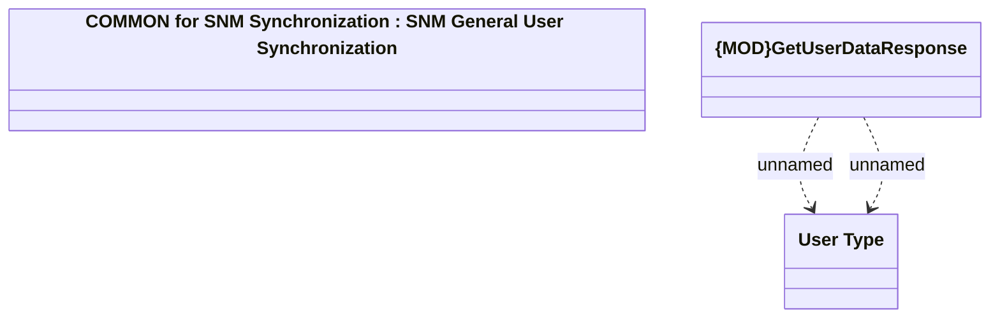

# SNM User Synchronization

- **Diagram Type**: Logical
- **Package**: HomerSelect/BSL/Analysis Model/_Interface/Consumed services/SNM Synchronization/User
- **Diagram ID**: 71899
- **Elements**: 3
- **Connectors**: 4

