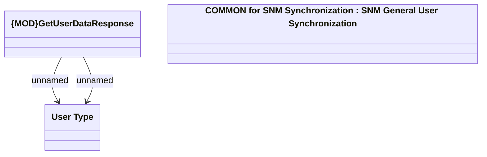

# SNM User Synchronization

```mermaid
classDiagram
    class MOD_GetUserDataResponse["{MOD}GetUserDataResponse"]
    class User_Type["User Type"]
    class COMMON_for_SNM_Synchronization_SNM_General_User_Synchronizat["COMMON for SNM Synchronization : SNM General User Synchronization"]
    MOD_GetUserDataResponse --> User_Type : unnamed
    MOD_GetUserDataResponse --> User_Type : unnamed
```
