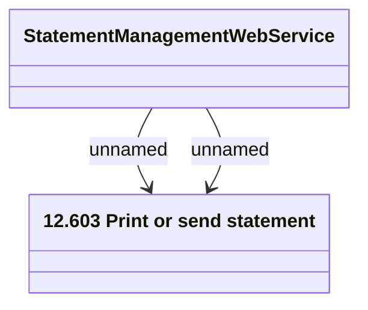

# Statement Management

- **Diagram Type**: Logical
- **Package**: HomerSelect/BSL/Analysis Model/_Interface/Consumed services/Statement Management
- **Diagram ID**: 98957
- **Elements**: 2
- **Connectors**: 2

