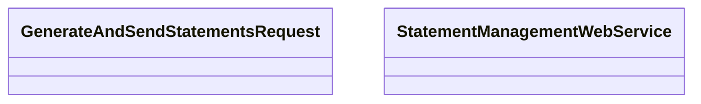

# GenerateAndSendStatements

- **Diagram Type**: Logical
- **Package**: HomerSelect/BSL/Analysis Model/_Interface/Consumed services/Statement Management/GenerateAndSendStatements
- **Diagram ID**: 99198
- **Elements**: 2
- **Connectors**: 0

