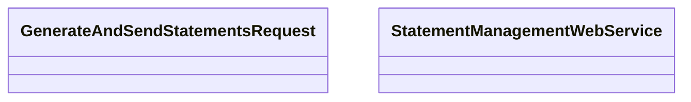

# GenerateAndSendStatements

```mermaid
classDiagram
    class GenerateAndSendStatementsRequest["GenerateAndSendStatementsRequest"]
    class StatementManagementWebService["StatementManagementWebService"]
```
