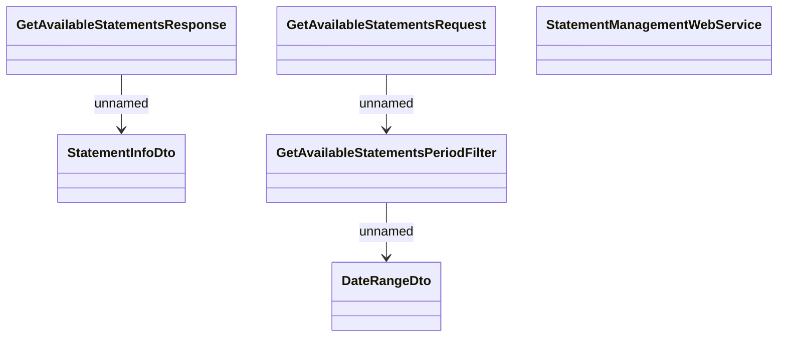

# GetAvailableStatements

- **Diagram Type**: Logical
- **Package**: HomerSelect/BSL/Analysis Model/_Interface/Consumed services/Statement Management/GetAvailableStatements
- **Diagram ID**: 99195
- **Elements**: 6
- **Connectors**: 3

