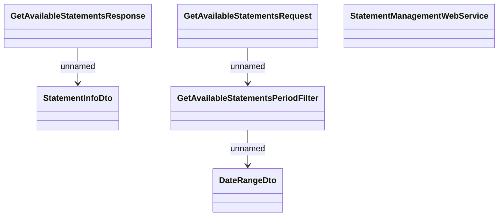

# GetAvailableStatements

```mermaid
classDiagram
    class DateRangeDto["DateRangeDto"]
    class StatementInfoDto["StatementInfoDto"]
    class GetAvailableStatementsPeriodFilter["GetAvailableStatementsPeriodFilter"]
    class GetAvailableStatementsResponse["GetAvailableStatementsResponse"]
    class GetAvailableStatementsRequest["GetAvailableStatementsRequest"]
    class StatementManagementWebService["StatementManagementWebService"]
    GetAvailableStatementsRequest --> GetAvailableStatementsPeriodFilter : unnamed
    GetAvailableStatementsResponse --> StatementInfoDto : unnamed
    GetAvailableStatementsPeriodFilter --> DateRangeDto : unnamed
```
