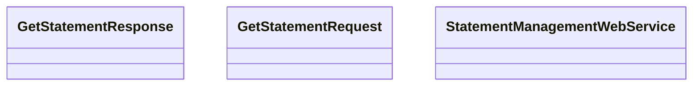

# GetStatement

- **Diagram Type**: Logical
- **Package**: HomerSelect/BSL/Analysis Model/_Interface/Consumed services/Statement Management/GetStatement
- **Diagram ID**: 99196
- **Elements**: 3
- **Connectors**: 0

