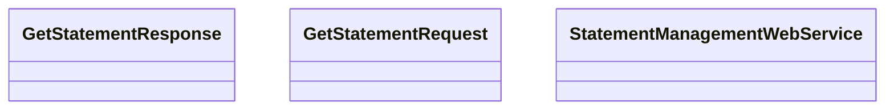

# GetStatement

```mermaid
classDiagram
    class GetStatementResponse["GetStatementResponse"]
    class GetStatementRequest["GetStatementRequest"]
    class StatementManagementWebService["StatementManagementWebService"]
```
