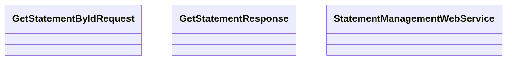

# GetStatementById

```mermaid
classDiagram
    class GetStatementByIdRequest["GetStatementByIdRequest"]
    class GetStatementResponse["GetStatementResponse"]
    class StatementManagementWebService["StatementManagementWebService"]
```
