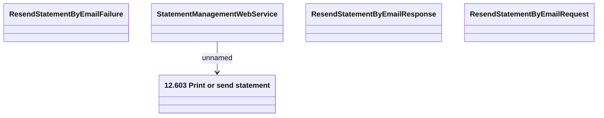

# ResendStatementByEmail

- **Diagram Type**: Logical
- **Package**: HomerSelect/BSL/Analysis Model/_Interface/Consumed services/Statement Management/ResendStatementByEmail
- **Diagram ID**: 99185
- **Elements**: 5
- **Connectors**: 1

