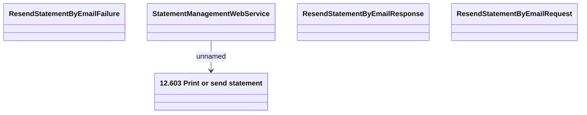

# ResendStatementByEmail

```mermaid
classDiagram
    class ResendStatementByEmailFailure["ResendStatementByEmailFailure"]
    class n_12_603_Print_or_send_statement["12.603 Print or send statement"]
    class StatementManagementWebService["StatementManagementWebService"]
    class ResendStatementByEmailResponse["ResendStatementByEmailResponse"]
    class ResendStatementByEmailRequest["ResendStatementByEmailRequest"]
    StatementManagementWebService --> n_12_603_Print_or_send_statement : unnamed
```
