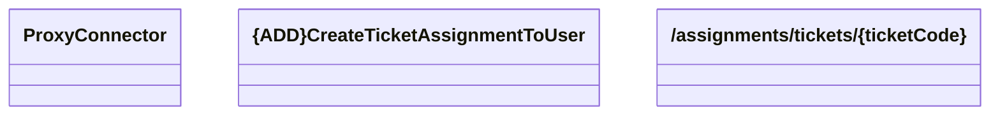

# assignTicketToUser

- **Diagram Type**: Logical
- **Package**: HomerSelect/BSL/Analysis Model/_Interface/Consumed services/TCK/v2/assignments/assignTicketToUser
- **Diagram ID**: 153843
- **Elements**: 5
- **Connectors**: 0

