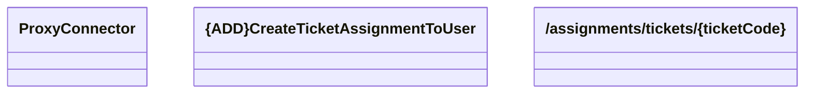

# assignTicketToUser

```mermaid
classDiagram
    class ProxyConnector["ProxyConnector"]
    class ProxyConnector["ProxyConnector"]
    class ProxyConnector["ProxyConnector"]
    class ADD_CreateTicketAssignmentToUser["{ADD}CreateTicketAssignmentToUser"]
    class assignments_tickets_ticketCode["/assignments/tickets/{ticketCode}"]
```
