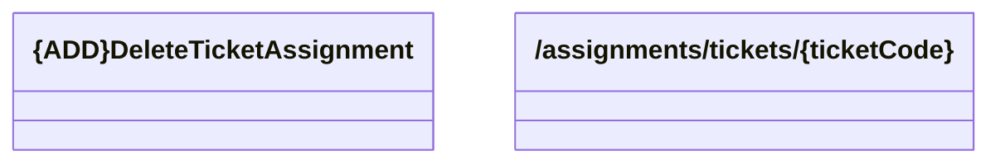

# unassignTicketFromUser

- **Diagram Type**: Logical
- **Package**: HomerSelect/BSL/Analysis Model/_Interface/Consumed services/TCK/v2/assignments/unassignTicketFromUser
- **Diagram ID**: 153844
- **Elements**: 2
- **Connectors**: 0

