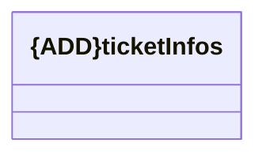

# ticketInfos

- **Diagram Type**: Logical
- **Package**: HomerSelect/BSL/Analysis Model/_Interface/Consumed services/TCK/v2/ticketInfos
- **Diagram ID**: 152514
- **Elements**: 1
- **Connectors**: 0

