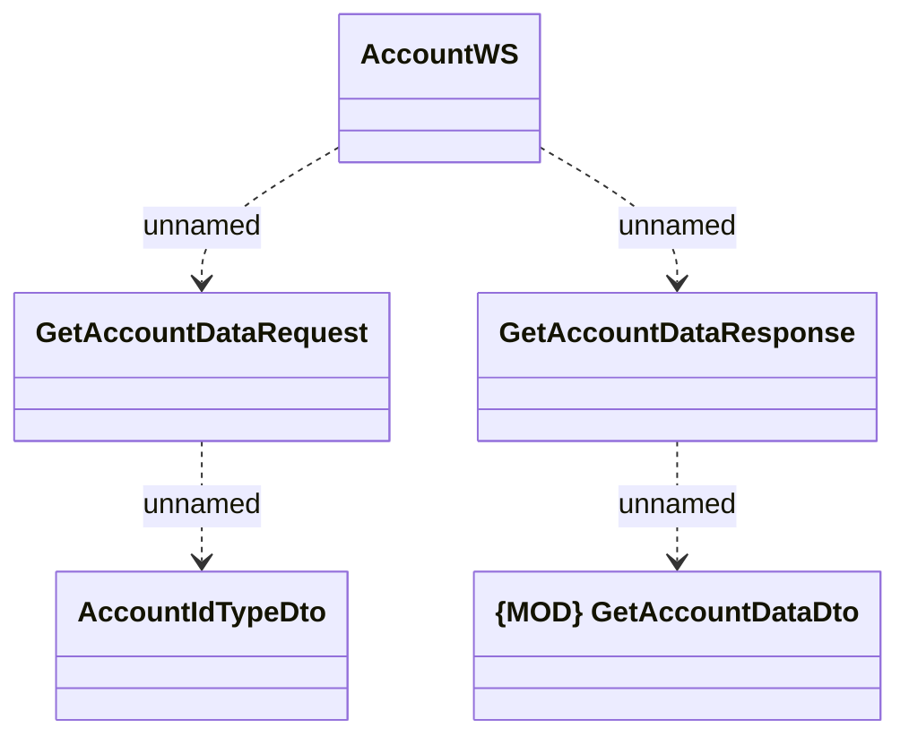

# AccountWS

- **Diagram Type**: Logical
- **Package**: HomerSelect/BSL/Analysis Model/_Interface/Consumed services/UMC/AccountWS
- **Diagram ID**: 67002
- **Elements**: 5
- **Connectors**: 4

```mermaid
classDiagram
    class MOD_GetAccountDataDto["{MOD} GetAccountDataDto"]
    class AccountIdTypeDto["AccountIdTypeDto"]
    class GetAccountDataResponse["GetAccountDataResponse"]
    class GetAccountDataRequest["GetAccountDataRequest"]
    class AccountWS["AccountWS"]
    AccountWS ..> GetAccountDataRequest : unnamed
    AccountWS ..> GetAccountDataResponse : unnamed
    GetAccountDataRequest ..> AccountIdTypeDto : unnamed
    GetAccountDataResponse ..> MOD_GetAccountDataDto : unnamed
```
