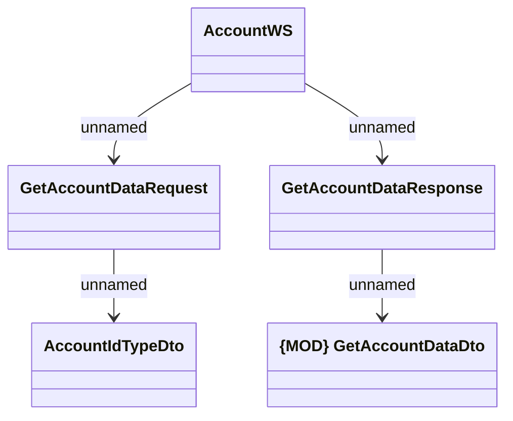

# AccountWS

```mermaid
classDiagram
    class MOD_GetAccountDataDto["{MOD} GetAccountDataDto"]
    class AccountIdTypeDto["AccountIdTypeDto"]
    class GetAccountDataResponse["GetAccountDataResponse"]
    class GetAccountDataRequest["GetAccountDataRequest"]
    class AccountWS["AccountWS"]
    AccountWS --> GetAccountDataRequest : unnamed
    AccountWS --> GetAccountDataResponse : unnamed
    GetAccountDataRequest --> AccountIdTypeDto : unnamed
    GetAccountDataResponse --> MOD_GetAccountDataDto : unnamed
```
