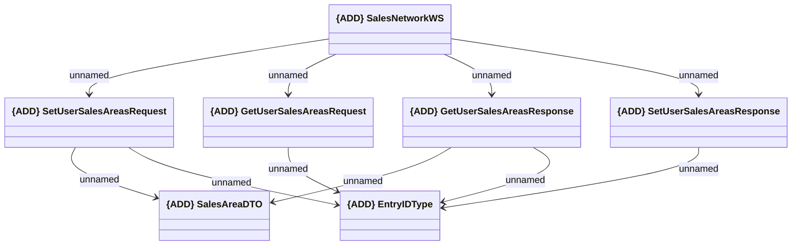

# SalesNetworkWS

```mermaid
classDiagram
    class ADD_EntryIDType["{ADD} EntryIDType"]
    class ADD_SalesAreaDTO["{ADD} SalesAreaDTO"]
    class ADD_SetUserSalesAreasResponse["{ADD} SetUserSalesAreasResponse"]
    class ADD_GetUserSalesAreasResponse["{ADD} GetUserSalesAreasResponse"]
    class ADD_GetUserSalesAreasRequest["{ADD} GetUserSalesAreasRequest"]
    class ADD_SetUserSalesAreasRequest["{ADD} SetUserSalesAreasRequest"]
    class ADD_SalesNetworkWS["{ADD} SalesNetworkWS"]
    ADD_SalesNetworkWS --> ADD_SetUserSalesAreasRequest : unnamed
    ADD_SalesNetworkWS --> ADD_GetUserSalesAreasRequest : unnamed
    ADD_SalesNetworkWS --> ADD_GetUserSalesAreasResponse : unnamed
    ADD_SalesNetworkWS --> ADD_SetUserSalesAreasResponse : unnamed
    ADD_GetUserSalesAreasResponse --> ADD_SalesAreaDTO : unnamed
    ADD_SetUserSalesAreasRequest --> ADD_SalesAreaDTO : unnamed
    ADD_SetUserSalesAreasResponse --> ADD_EntryIDType : unnamed
    ADD_GetUserSalesAreasResponse --> ADD_EntryIDType : unnamed
    ADD_GetUserSalesAreasRequest --> ADD_EntryIDType : unnamed
    ADD_SetUserSalesAreasRequest --> ADD_EntryIDType : unnamed
```
