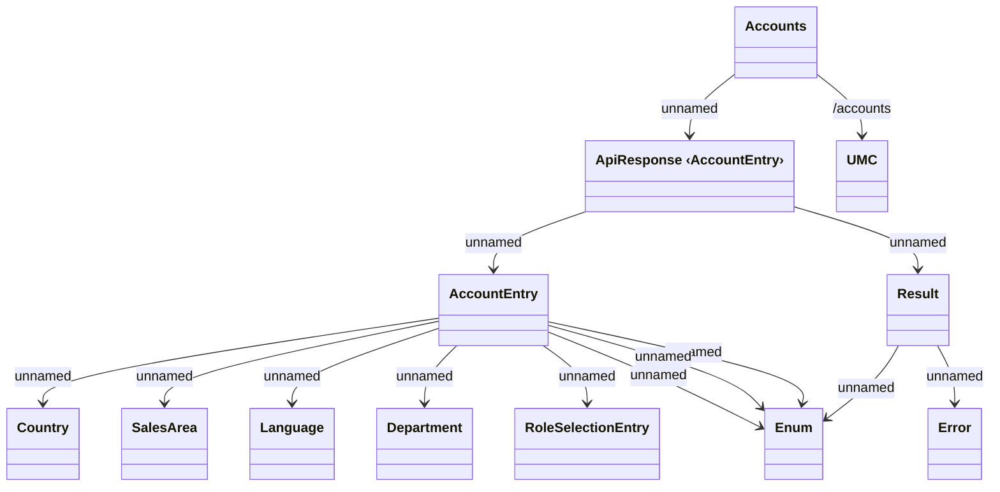

# UMC REST accounts

```mermaid
classDiagram
    class Enum["Enum"]
    class Enum["Enum"]
    class Enum["Enum"]
    class Enum["Enum"]
    class Error["Error"]
    class Result["Result"]
    class RoleSelectionEntry["RoleSelectionEntry"]
    class Department["Department"]
    class Language["Language"]
    class SalesArea["SalesArea"]
    class Country["Country"]
    class AccountEntry["AccountEntry"]
    class ApiResponse_AccountEntry["ApiResponse ‹AccountEntry›"]
    class Accounts["Accounts"]
    class UMC["UMC"]
    Accounts --> UMC : /accounts
    Accounts --> ApiResponse_AccountEntry : unnamed
    ApiResponse_AccountEntry --> AccountEntry : unnamed
    AccountEntry --> Country : unnamed
    AccountEntry --> SalesArea : unnamed
    AccountEntry --> Language : unnamed
    AccountEntry --> Department : unnamed
    AccountEntry --> RoleSelectionEntry : unnamed
    ApiResponse_AccountEntry --> Result : unnamed
    Result --> Error : unnamed
    Result --> Enum : unnamed
    AccountEntry --> Enum : unnamed
    AccountEntry --> Enum : unnamed
    AccountEntry --> Enum : unnamed
```
