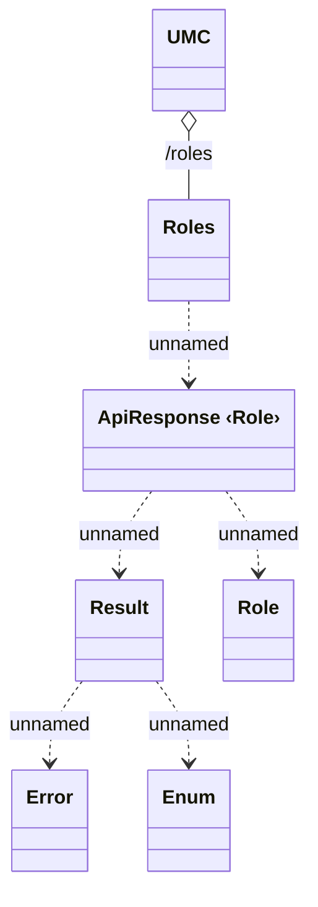

# {ADD LOR-4899/}UMC REST roles

- **Diagram Type**: Logical
- **Package**: HomerSelect/BSL/Analysis Model/_Interface/Consumed services/UMC/UMC REST
- **Diagram ID**: 130112
- **Elements**: 7
- **Connectors**: 6

